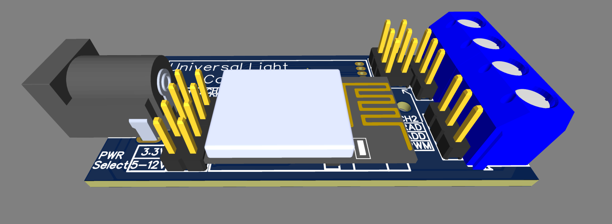
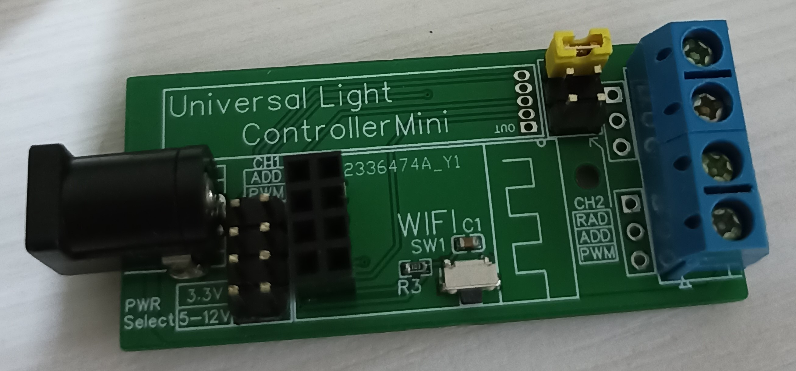

# Universal Presence Sensor

This repository contains all the materials related to my **Universal Presence Sensor**, based on the **HLK-LD2410 radar sensor**.

  
  

---

## **Features**
1. **ESP01 Module Powered by ESPHome**  
   The sensor runs ESPHome for seamless integration with Home Assistant.  

2. **Presence Detection with HLK-LD2410/HLK-LD2410B**  
   These affordable radar sensors ensure reliable presence detection.

3. **Power Supply**  
   - Standard **DC barrel jack** for power.  
   - Supports input voltage from **3.3V** up to **12V**.

4. **Configurable GPIOs**  
   The two available GPIOs can be configured to suit your specific needs.

5. **LED Strip Control**  
   - Supports brightness control for up to two 5V/12V standard LED strips via **PWM**.

6. **PIR Sensor Support**  
   Enhance presence detection with an additional **PIR motion sensor**.

---

## **Project Background**
This project began in **January 2023**, during the early days of my Home Assistant journey. At that time, presence sensors based on radar technology were expensive and hard to source in my country.  

While searching for an alternative, I discovered the **HLK-LD2410 sensors** on AliExpress at a very reasonable price. Excited by the opportunity, I purchased a few units and designed this sensor to integrate with Home Assistant using ESPHome.  

---

## **Configuration**
1. **Power**
	- Can be powered from 3.3V, in this case the "PWR Select" jumper should be set to 3.3V position
	- Can be powered from 5-12V, in which case the jumper should be changed, accordingly
	
2. **Channel 1**
	- Can control a strip of addressable LED (Set the "CH1" jumper to "ADD")
	- Can control a strip of simple LED via PWM (Set the "CH1" jumper "PWM")
	- Can be used as input (Set the "CH1" jumper to "ADD" and configure it as input)
	
3. **Channel 2**
	- Can be connected to the Radar output (Set the "CH2" jumper "RAD")
	- Can control a strip of addressable LED (Set the "CH2" jumper "ADD")
	- Can control a strip of simple LED via PWM (Set the "CH2" jumper "PWM")
	- Can be used as input (Set the "CH2" jumper to "ADD" and configure it as input)
	
### **Note:**
Please take into consideration that if you plan to control a LED strip, the input power you are giving to the module should match the power needed for the strip, as it is powered directly from the input.

Example 1: If you want to power a WS2812B strip of addressable LEDs, then you need to power the module from 5V and set the input power jumper accordingly.

Example 2: If you want to control a 12V simple Cold White LED strip, you need to power the module from 12V.

Example 3: If you want to use the module for presence detection only, paired with the radar sensor, it can be safely powered from 3.3V only.

---

## **Use Cases**
Currently, I have **three sensors** installed in my home, each serving unique purposes:

1. **Bathroom Automation**  
   - Installed to automate the lights.  
   - Operates with a success rate of **99.5%**, with no false positives and almost no false negatives.  

2. **Work Desk Setup**  
   - Equipped with one radar and one PWM output to control a LED strip that illuminates my keyboard based on specific conditions.  

3. **Closet Lighting**  
   - Similar to the bathroom sensor, it controls the lights.  
   - Performance is slightly affected by the closet’s layout, as items may obstruct the radar’s view in certain scenarios.  

---

## **Why This Project?**
At the time, affordable radar-based presence sensors were a rarity. By creating this sensor, I managed to fill a gap in the market while learning and experimenting with Home Assistant and ESPHome.  

---

## **Improvements for next version:**
- Power via Type C
- Decrease the footprint
- Revisit the case
- Connect the radar sensor via UART to ESP
- Add ferrite beads on the power line to the PIR sensor to try and solve the false positives
